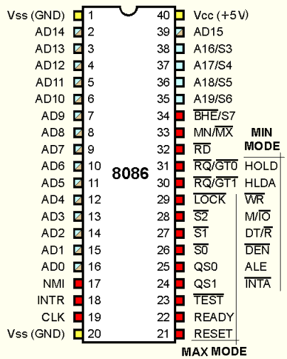

# CPU pins

## Simplified CPU

For many purposes, you can picture a CPU as having only the following pins:

- memory selector
- data
- clock
- ground and 5V

## Read or write two memory slots at once

<http://stackoverflow.com/questions/11953352/why-ia32-does-not-allow-memory-to-memory-mov>

Impossible, since there is only one memory selector at a time.

So instructions can never operate at two different memory locations at once, nor read and write at a single memory location at once.

## Pinout

It is a good idea to understand what are the physical pins of the processor and what they do to understand what is actually going on when you do instructions

TODO understand

## Real CPUs

<https://en.wikipedia.org/wiki/CPU_socket>
